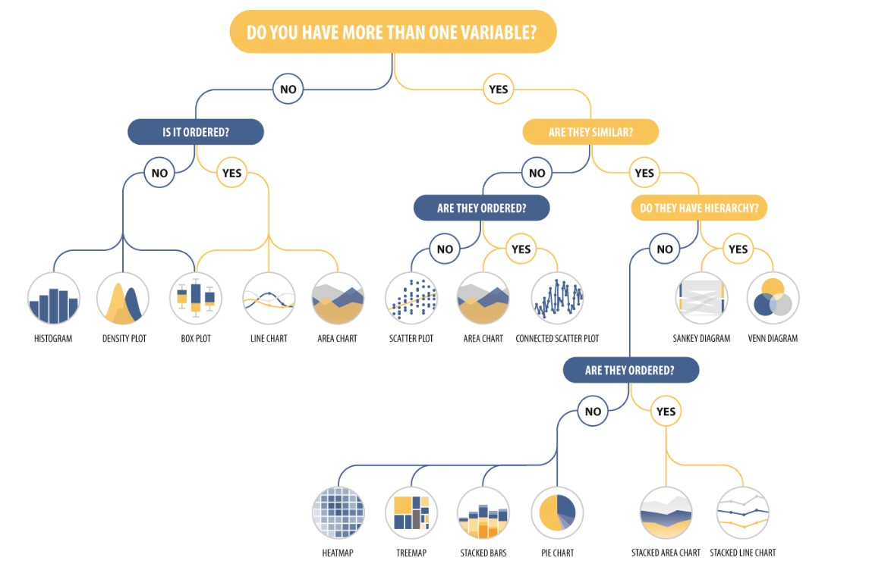
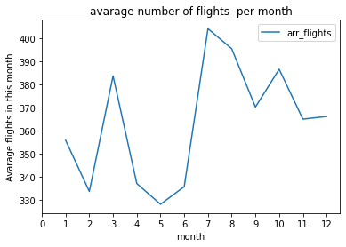

# flight cancelation and Delays 
## Table of contents
- [Introduction](#Introduction)
- [Dataset](#Dataset)
- [Wrangling process](#Wrangling_process)
- [Key_insights](#Key_insights)

## Introduction
When we hear about flight delay or cancellation the first thing we think about is weather or security reasons , in this data set we explore more about that and if what we mean by bad weather winter only or winter and summer .

## Dataset
Dataset I used is the [RITA daset](http://stat-computing.org/dataexpo/2009/the-data.html)
which contains flight  statistics from the US airports and carriers. containing data from 2013 till 2020 .data contain RangeIndex: 63552 entries, 0 to 63551
Data columns (total 22 columns) . 

## Wrangling_process
* removing all values of null 
* remove unnamed columns 
* reshape city column . 
* rename month column .

## some of visualizations
.png)

.png)

.png)

## Key_insights
* chosing the best month for a trip is not easy as we saw before we might get cheap ticket , but we may have high probability of delay or cancelation . 
* weather affects appear in both summer and winter . 
* any issue with a flight affect other flights and may cause a lot of delay . 
